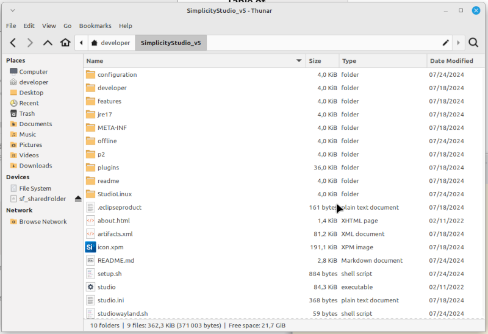
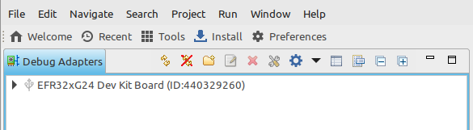
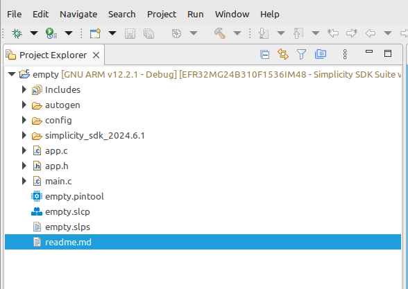

### Table of contents

Click on the  icon, on the right-hand side above.

# Overview

This short tutorial describes a way to make a virtual machine (VM) configured for developing software for an EFR32 target with Simplicity Studio. It also explains how to start using it. The virtualization environment is *VirtualBox*, and the guest machine runs *Linux Mint*.

Versions are:
* Linux Mint Xfce: 21.3
* Simplicity Studio: 5.9.1

# Prerequisites

* Hardware: a 64-bit computer with enough memory so that the VM can be granted 4 GB, with a few tens of GB available on the disk, and one free USB A port
* Hardware (bis): an [EFR32xG24 Dev Kit](https://www.silabs.com/development-tools/wireless/efr32xg24-dev-kit?tab=overview) with the provided USB micro-B cable to connect it to the computer. Other EFR32 boards may be used as well, but only the EF32xG24 is considered in this tutorial
* Software development competencies:
  * Basic knowledge of *git*
  * Basic knowledge of *GitHub*
  * Basic knowledge of *Linux* (knowing the most common commands...)
  * Basic knowledge of *VirtualBox* (knowing how to create a virtual machine...)
  * Good knowledge of one programming language

We consider that the home directory is named `developer`.

# Creation of the VM

The first step is to create the Linux VM. For this, check [this guide](https://github.com/PascalBod/lm-vm), *xfce21.3* tag.

# VM configuration

## Reference documents

* [Simplicity Studio User's Guide](https://docs.silabs.com/simplicity-studio-5-users-guide/5.9.1/ss-5-users-guide-overview/)

## Prerequisites

Create an account on the [Silicon Labs website](https://docs.silabs.com), by clicking on the login icon in the top right-hand corner, and selecting *Register*. An account is required for downloading Simplicity Studio.

## Installation of Simplicity Studio

Download the Linux Installer from [this page](https://www.silabs.com/developers/simplicity-studio).

To check the integrity of the downloaded file (`SimplicityStudio-5.tgz`), download the Linux SHA256 file, provided by the same page. Open a terminal window, go into the directory where the Linux Installer and the SHA256 files are, and enter the following command:
```
$ sha256sum -c SimplicityStudio-5.tgz.sha256 
```

The resulting output should be:
```
./SimplicityStudio-5.tgz: OK
```

If this is not the case, download again the Linux Installer.

Note: if you used *Firefox* to download the Linux Installer, the file should be in the `developer/Downloads` subdirectory.

Extract the contents of the Linux Installer file into the `developer` directory. One way to do it is to start the File Manager, display the contents of the `Downloads` directory, and double-click on the `SimplicityStudio-5.tgz` file. Then select the `developer` directory as the target of the extraction operation.

The resulting directory tree should look like:



Follow the instructions provided [here](https://docs.silabs.com/simplicity-studio-5-users-guide/5.9.1/ss-5-users-guide-getting-started/install-ss-5-and-software#on-linux). Some additional information:
* Run the `setup.sh` script, not the `studiowayland.sh` one.
* When the script ends, run the `studio` executable which is in the `developer/SimplicityStudio_v5` directory, either from a terminal window or from the File Manager. Accept the licenses. Login with your Silicon Labs account.
* In the Installation Manager window, select *Install by technology type*. In the next window, tick *32-bit and Wireless MCUs*. You can then untick *Silicon Labs Amazon Sidewalk SDK*.
* In the *Package Installation Options*, keep the default choice, *Auto*
* Accept all the licenses.
* At some point, Simplicity Studio needs to install a package: it asks for your password. Provide it.

# EFR32xG24 Dev Kit connection

Connect the board to a USB port of the computer.

Check that the virtual machine can see it, with **Devices > USB** (in the VirtualBox window menu). A new USB device should be visible: **Silicon Labs J-Link OB**. Tick the associated checkbox.

You can assign the board to the virtual machine on a permanent basis with **Devices > USB > USB Settings...**.

The board should appear in the *Debug Adapters* view of Simplicity Studio:



and the blue LED near the USB connector should be on.

# Sample application

Click **File > New > Silicon Labs Project Wizard...**.

In the wizard window, type `Dev Kit` in the **Target Boards** filed and then select the board reference corresponding to the mark printed on the bottom side of the board you have. Mine is marked `BRD2601B Rev A01`. Consequently, I select **EFR32xG24 DevKit Board (BRD2601B Rev A01)**.

Select **Simplicity SDK Suite v2024.6.1...** for the **SDK** field.

Select **Simplicity IDE / GNU ARM v12.2.1** for the **IDE / Toolchain** field.

Click the **NEXT** button.

In the Example Project Selection, click the **Empty C Project** rectangle. Click the **NEXT** button.

In the Project Configuration window, choose a project name, or keep the proposed one (`empty`). Keep the other default values. Click the **FINISH** button.

Simplicity Studio display a new view, the **Project Explorer** view:



In the Project Explorer View, right-click the name of the project (`empty`) and select **Build Project**.

Once the build is finished, right-click again `empty` and select **Run As > 1 Silicon Labs ARM Program**. The blue LED near the USB connector should blink for a short period of time.