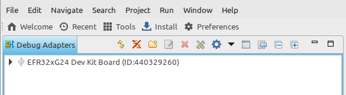
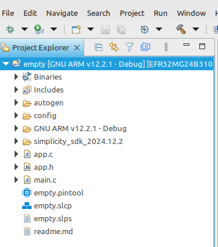

# Overview

This short tutorial describes a way to make a virtual machine (VM) configured for developing software for an EFR32 target with Simplicity Studio. It also explains how to start using it. The virtualization environment is VirtualBox, and the guest machine runs Linux Mint.

Versions are:
* Linux Mint 22.3 MATE
* Simplicity Studio 6.1
* Simplicity SDK Suite vnnnn.n.n

# Prerequisites

* Hardware: a 64-bit computer with enough memory so that the VM can be granted 8 GB at least, with a few tens of GB available on the disk, and one free USB A port
* Hardware (bis): an [EFR32xG24 Dev Kit](https://www.silabs.com/development-tools/wireless/efr32xg24-dev-kit?tab=overview) with the provided USB micro-B cable to connect it to the computer. Other EFR32 boards may be used as well, but only the EF32xG24 is considered in this tutorial
* Software development competencies:
  * Basic knowledge of Git - [git user manual](https://git-scm.com/docs/user-manual)
  * Basic knowledge of GitHub - [About GitHub and Git](https://docs.github.com/en/get-started/start-your-journey/about-github-and-git)
  * Basic knowledge of Linux (knowing the most common commands...) - [An Introduction to Linux Basics, from DigitalOcean](https://www.digitalocean.com/community/tutorials/an-introduction-to-linux-basics)
  * Basic knowledge of VirtualBox (knowing how to create a virtual machine...) - [End-user documentation](https://www.virtualbox.org/wiki/End-user_documentation)
  * Good knowledge of one programming language

We consider that the VM user is *developer* and that the home directory is `developer`.

# Creation of the VM

The first step is to create the Linux VM. For this, adhere to [this guide](https://github.com/PascalBod/lm-vm/tree/mate22.3). Make sure that the *mate22.3* branch is selected.

# Development environment setup

## Reference document

* [Simplicity Studio 6 User's Guide](https://docs.silabs.com/ssv6ug/latest/ssv6ug-overview/)

## Installation of Simplicity Studio

Install the Linux Simplicity Studio Installer in the VM according to [these instructions](https://docs.silabs.com/ssv6ug/latest/install-ssv6/install-simplicity-studio#linux-installation). At the time of writing, the Installer version is v1.2.0.

Then, continue by adhering to [Simplicity Studio Installation Steps Common to All Operating Systems](https://docs.silabs.com/ssv6ug/latest/install-ssv6/install-simplicity-studio#simplicity-studio-installation-steps-common-to-all-operating-systems), selecting the *Technology Install* track. Add **AI / ML** to the list of 7 preselected elements.

The installation creates a desktop shortcut, named `Simplicity Studio.desktop`. Move it into the `/home/developer/.local/share/applications` directory.

> [!Note]
> If you use *Caja*, the standard file manager, request to display hidden files: **View / Show Hidden Files**. You can also set the related preference: **Edit / Preferences / Views / Show hidden files**.

Add the following two lines to the file:
```
Categories=Development;Programming;
Icon=/home/developer/.silabs/slt/installs/archive/v6-base-v6.2.0-282/SimplicityStudio-6/icon.xpm
```

> [!Note]
> You can add the lines with the **Accessories / Text Editor** application.

> [!Note]
> For the icon file path, use the value of the `Path` variable defined in the desktop shortcut file.


**TODO**: check whether [recipe](https://docs.silabs.com/ssv6ug/latest/ssv6-import-and-export-recipes/) could be a good way to ensure common versions.

## Installation of Visual Studio Code

Once Simplicity Studio is installed, install Visual Studio Code (VS Code): download the `.deb` package from [this page](https://code.visualstudio.com/download) and install it. At the time of writing, the version is v1.126.0.

Start VS Code (from Mint menu). Do not sign in and close the *Build with AI Agents* window.

Install the Simplicity Studio VS Code Extension, according to [these instructions](https://docs.silabs.com/ss-vscode/latest/ss-vscode-getting-started-overview/#install-the-simplicity-studio-vs-code-extension).


# EFR32xG24 Dev Kit connection

1. Connect the board to a USB port of the computer.
2. Check that the virtual machine can see it, with **Devices > USB** (in the VirtualBox window menu). A new USB device should be visible: **Silicon Labs J-Link OB**. Tick the associated checkbox.
3. You can assign the board to the virtual machine on a permanent basis with **Devices > USB > USB Settings...**.

The board should appear in the *Debug Adapters* view of Simplicity Studio:



and the blue LED near the USB connector should be on.

# Sample application

1. Click **File > New > Silicon Labs Project Wizard...**.
2. In the wizard window, type `Dev Kit` in the **Target Boards** field and then select the board reference corresponding to the mark printed on the bottom side of the board you have. Mine is marked `BRD2601B Rev A01`. Consequently, I select **EFR32xG24 DevKit Board (BRD2601B Rev A01)**.
3. Select **Simplicity SDK Suite v2025.6.2...** for the **SDK** field.
4. Select **Simplicity IDE / GNU ARM v12.2.1** for the **IDE / Toolchain** field.
5. Click the **NEXT** button.
6. In the Example Project Selection, click the **Empty C Project** rectangle. Click the **NEXT** button.
7. In the Project Configuration window, choose a project name, or keep the proposed one (`empty`). Keep the other default values. Click the **FINISH** button.

Simplicity Studio display a new view, the **Project Explorer** view:



8. In the Project Explorer View, right-click the name of the project (`empty`) and select **Build Project**.
9. Once the build is finished, right-click `empty` again and select **Run As > 1 Silicon Labs ARM Program**. The blue LED near the USB connector should blink for a short period of time.

You can then try the **Platform - Blink Bare-metal** sample application, whick makes blink the board's LED.