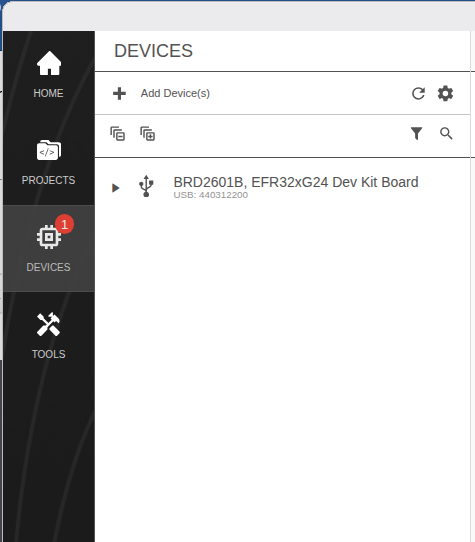
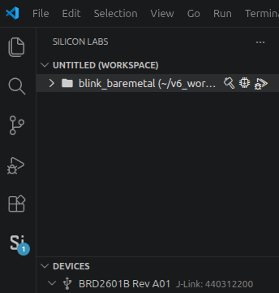
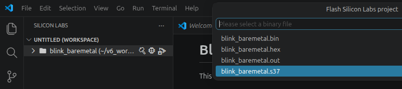

# Overview

This short tutorial describes a way to make a virtual machine (VM) configured for developing software for an EFR32 target with Simplicity Studio 6. It also explains how to start using it. The virtualization environment is VirtualBox, and the guest machine runs Linux Mint.

Versions are:
* Linux Mint 22.3 MATE
* Simplicity Studio 6.1
* Simplicity SDK Suite v2026.6.0

# Prerequisites

* Hardware: a 64-bit computer with enough memory so that the VM can be granted 8 GB at least, with a few tens of GB available on the disk, and one free USB A port
* Hardware (bis): an [EFR32xG24 Dev Kit](https://www.silabs.com/development-tools/wireless/efr32xg24-dev-kit?tab=overview) with the provided USB micro-B cable to connect it to the computer. Other EFR32 boards may be used as well, but only the EF32xG24 is considered in this tutorial
* Software development competencies:
  * Basic knowledge of Git - [git user manual](https://git-scm.com/docs/user-manual)
  * Basic knowledge of GitHub - [About GitHub and Git](https://docs.github.com/en/get-started/start-your-journey/about-github-and-git)
  * Basic knowledge of Linux (knowing the most common commands...) - [An Introduction to Linux Basics, from DigitalOcean](https://www.digitalocean.com/community/tutorials/an-introduction-to-linux-basics)
  * Basic knowledge of VirtualBox (knowing how to create a virtual machine...) - [End-user documentation](https://www.virtualbox.org/wiki/End-user_documentation)
  * Good knowledge of one programming language

We consider that the VM user is *developer* and that the home directory is `developer`.

# Creation of the VM

The first step is to create the Linux VM. For this, adhere to [this guide](https://github.com/PascalBod/lm-vm/tree/mate22.3). Make sure that the *mate22.3* branch is selected.

# Development environment setup

## Installation of Simplicity Studio

Install the Linux Simplicity Studio Installer in the VM according to [these instructions](https://docs.silabs.com/ssv6ug/latest/install-ssv6/install-simplicity-studio#linux-installation). At the time of writing, the Installer version is v1.2.0.

> [!Note]
> The Installer can be downloaded from the [*GETTING STARTED* tab](https://www.silabs.com/software-and-tools/simplicity-studio?tab=getting-started).

Then, continue by adhering to [Simplicity Studio Installation Steps Common to All Operating Systems](https://docs.silabs.com/ssv6ug/latest/install-ssv6/install-simplicity-studio#simplicity-studio-installation-steps-common-to-all-operating-systems), selecting the *Technology Install* track. Add **AI / ML** to the list of 7 preselected elements.

The installation creates a desktop shortcut, named `Simplicity Studio.desktop`. 

Add the following two lines to the file:
```
Categories=Development;Programming;
Icon=/home/developer/.silabs/slt/installs/archive/v6-base-v6.2.0-282/SimplicityStudio-6/icon.xpm
```

> [!Note]
> You can add the lines with the **Accessories > Text Editor** application.

> [!Note]
> For the icon file path, use the value of the `Path` variable defined in the desktop shortcut file.

Move the file into the `/home/developer/.local/share/applications` directory.

> [!Note]
> If you use *Caja*, the standard file manager, request to display hidden files: **View > Show Hidden Files**. You can also set the related preference: **Edit > Preferences > Views > Show hidden files**.

You can close the Simplicity Installer window.

## Installation of Visual Studio Code

Once Simplicity Studio is installed, install Visual Studio Code (VS Code): download the `.deb` package from [this page](https://code.visualstudio.com/download) and install it. At the time of writing, the version is v1.127.0.

Start VS Code (from Mint menu: **Programming > Visual Studio Code**). Close the **Welcome to VS Code** window. Close the **CHAT** side bar.

Install the Simplicity Studio VS Code Extension, according to [these instructions](https://docs.silabs.com/ss-vscode/latest/ss-vscode-getting-started-overview/#install-the-simplicity-studio-vs-code-extension). The extension version is 2.1.86 at the time of writing.

When requested for restarting, restart.

With the Software Manager (in main menu), install *clangd*.

# EFR32xG24 Dev Kit connection

Install the SEGGER J-Link package:
1. Download it from [SEGGER website](https://www.segger.com/downloads/jlink/) - select the Linux 64-bit DEB Installer. At the time of writing, the version is V9.56.
2. Install the package (double click on it from the window manager).

Connect the board to the VM:
1. Connect the board to a USB port of the computer.
2. Check that the virtual machine can see it, with **Devices > USB** (in the VirtualBox window menu). A new USB device should be visible: **Silicon Labs J-Link OB**. Tick the associated checkbox.
3. You can assign the board to the virtual machine on a permanent basis with **Devices > USB > USB Settings...**.

Start Simplicity Studio (main menu: **Programming > Simplicity Studio**). The board should be present in the device list:



The blue LED near the USB connector should be on.

# Sample application

## Project creation

Create a project for building a sample application which makes the red LED blink:
1. If not yet done, start Simplicity Studio (see above).
2. If not yet done, connect the dev kit to the VM (see above)
3. Follow these [instructions](https://docs.silabs.com/ssv6ug/latest/ssv6-create-project/02-create-project-from-a-connected-device), until the **Example projects & demos** page is displayed.
4. In the **Filter on keywords** field, enter `blink` and press the Enter key. 10 items should be displayed in the demos and examples region.
5. Click the **CREATE** button of the **Platform - Blink Bare-metal** example.
6. In the **Project Configuration** window, keep the default values, and click the **FINISH** button.

## Building the application

Click the **Open in VS Code** button.

In VS Code window, accept to trust the authors of the files. Then, close VS Code and restart it. This will create a workspace, required to build and flash the application.

Click the **blink_baremetal** project under the untitled workspace:



Click the hammer icon, on the right side of the project name. This action builds the application (firmware).

Then, click the chip icon, and select the `blink_baremetal.s37` file :



This action flashes the board with the firmware.

Once done, the red LED should start blinking.